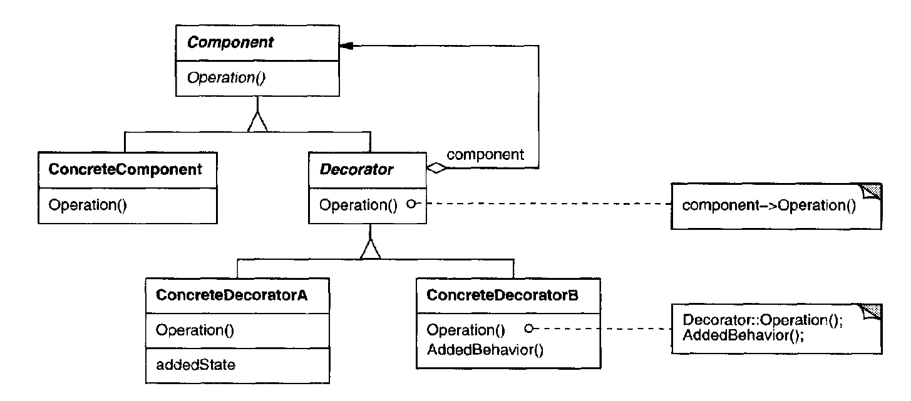

# Design Patterns

## Objective
This is pratical study implementation of some design patterns based on the books:  
- Explanations: Design Patterns: Elements of Reusable Object-Oriented Software
- Problems: Head First Design Patterns

## Patterns
### 1. Strategy
Define a family of algorithms, encapsulate each one, and make them interchangeable. Strategy lets the algorithm vary independently from clients that use it.

Link: [Strategy](./patterns/strategy/strategy.md)

### 2. Observer
Define a one-to-many dependency between objects so that when one object changes state, all its dependents are notified and updated automatically.

Link: [Observer](./patterns/observer/observer.md)

### 3. Decorator
Attach additional responsibilities to an object dynamicall y.Decorators provide a flexible alternative to subclassing for extending functionality.

Link: [decorator](./patterns/decorator/decorator.md)
