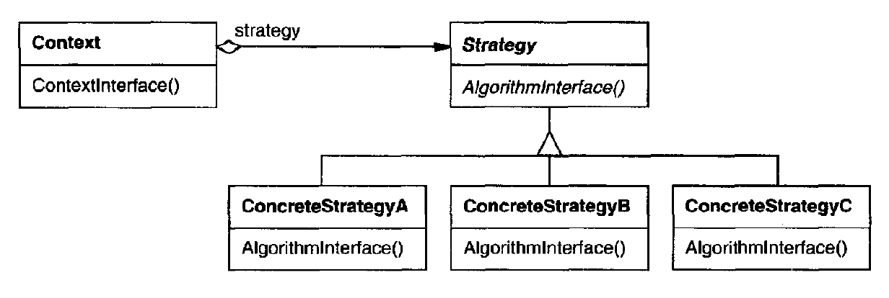

# Design Patterns

## Objective
This is pratical study implementation of some design patterns based on the books:  
- Explanations: Design Patterns: Elements of Reusable Object-Oriented Software
- Problems: Head First Design Patterns

## Patterns
### 1. Strategy
Define a family of algorithms, encapsulate each one, and make them interchangeable. Strategy lets the algorithm vary independently from clients that use it.

Link: [Strategy](./patterns/strategy/strategy.md)
