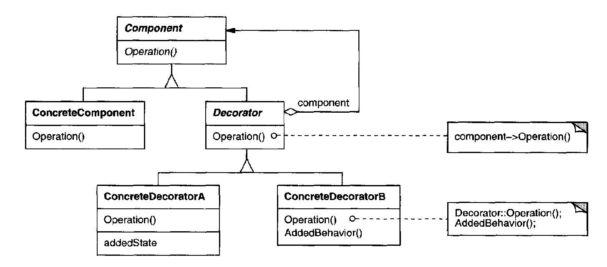

# Decorator
Attach additional responsibilities to an object dynamicall y.Decorators provide a flexible alternative to subclassing for extending functionality.

## Structure

#### Component
- Defines the interface for objects that can have responsibilities added to them dynamically.
#### ConcreteComponent
- Defines an object to which additional responsibilities can be attached.
#### Decorator
- Maintains a reference to a Component object and defines an interface that conforms to Component's interface.
#### ConcreteDecorator
- adds responsibilities to the component.

## Flow
- Decorator forwards requests to its Component object. It may optionally perform additional operations before and after forwarding the request.

## Example
Link: [Starbuzz](./problem.md)

## Applicability
- Add responsibilities to individual objects dynamically and transparently, that is, without affecting other objects.
- For responsibilities that can be withdrawn.
- When extension by subclassing is impractical. Sometimes a large number of independent extensions are possible and would produce an explosion of subclasses to support every combination. Or a class definition maybe hidden or otherwise unavailable for subclassing.

## Advantages vs Disavantages
1. <b>More flexibility than static inheritance</b>: The Decorator pattern provides a more flexible way to add responsibilities to objects than can be had with static (multiple) inheritance. With decorators, responsibilities can be added and removed at run-time simply by attaching and detaching them. In contrast, inheritance requires creating a new class for each additional responsibility. This gives rise to many classes and increases the complexity of a system. Furthermore, providing different Decorator classes for a specific Component class lets you mix and match responsibilities. Decorators also make it easy to add a property twice. Inheriting
from a class twice is error-prone at best.
2. <b>Avoids feature-laden classes high up in the hierarchy</b>: Decorator offers a pay-as-you-go approach to adding responsibilities. Instead of trying to support all foreseeable features in a complex, customizable class, you can define a simple class and add functionality incrementally with Decorator objects. Functionality can be composed from simple pieces. As a result, an application doesn't need to pay for features it doesn't use. It's also easy to define new kinds of Decorators independently from the classes of objects they extend, even for unforeseen extensions. Extending a complex class tends to expose details unrelated to the responsibilities you're adding.
3. <b>A decorator and its component aren't identical</b>. A decorator acts as a transparent enclosure. But from an object identity point of view, a decorated component is not identical to the component itself. Hence you shouldn't rely on object identity when you use decorators.
4. <b>Lots of little objects</b>. A design that uses Decorator often results in systems composed of lots of little objects that all look alike. The objects differ only in the way they are interconnected, not in their class or in the value of their variables. Although these systems are easy to customize by those who understand them, they can be hard to learn and debug.
