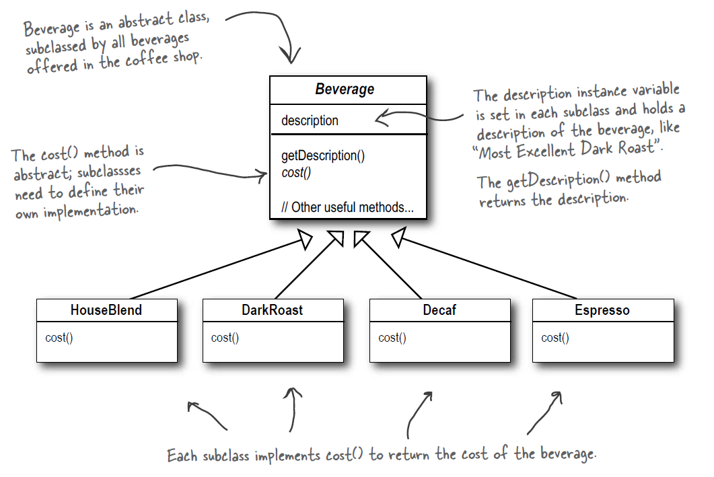
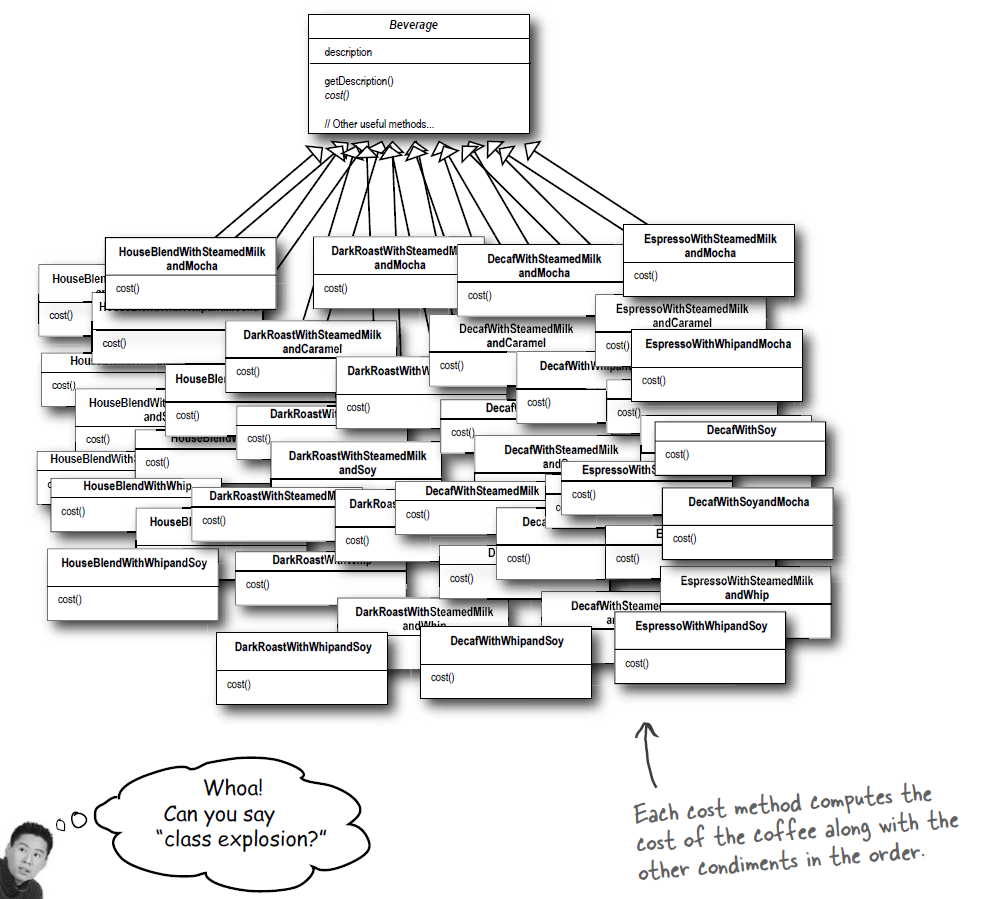
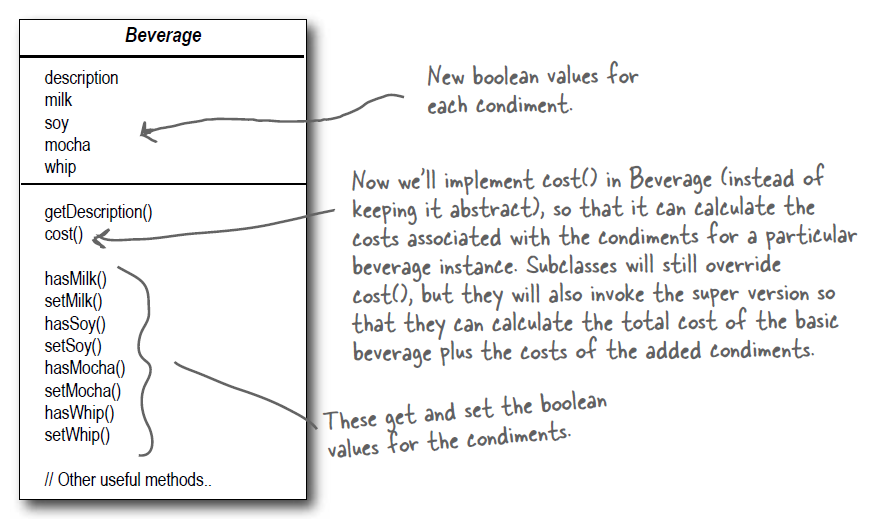
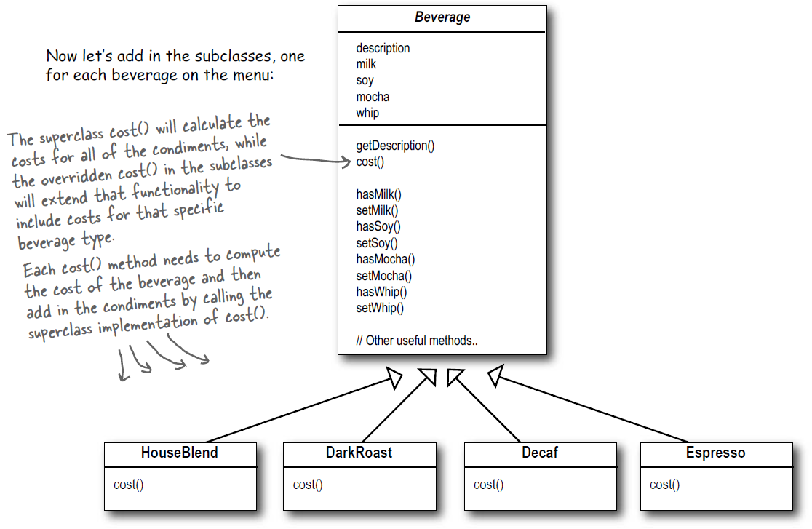
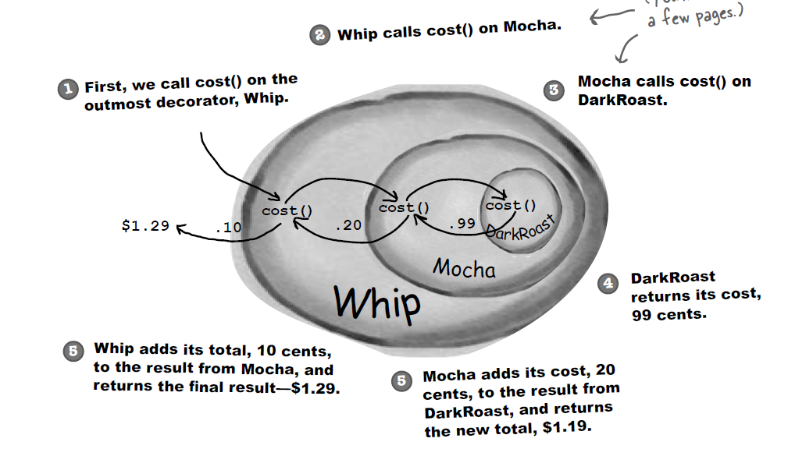
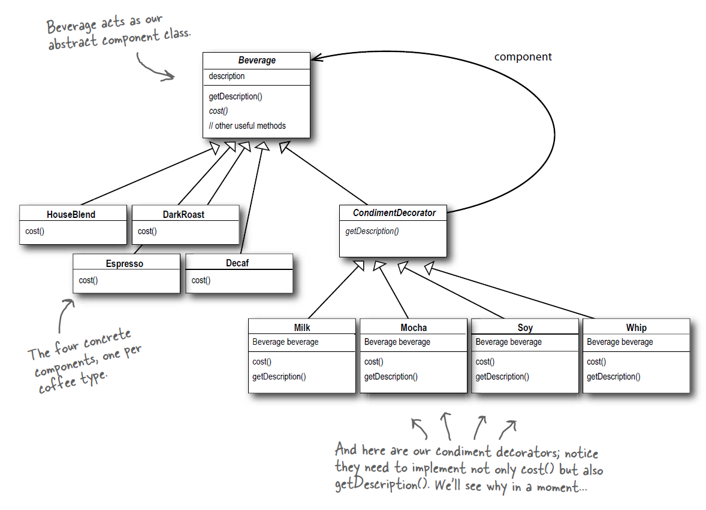

## Context
Starbuzz Coffee has made a name for itself as the fastest growing coffee shop around. If you’ve seen one on your local corner, look across the street; you’ll see another one.
Because they’ve grown so quickly, they’re scrambling to update their ordering systems to match their beverage offerings.
When they first went into business they designed their classes like this....

## Problem
1. In addition to your coffee, you can also ask for several condiments like steamed milk, soy, and mocha (otherwise known as chocolate), and have it all topped off with whipped milk. Starbuzz charges a bit for each of these, so they really need to get them built into their order system. Here’s their first attempt...

2. Let's implement instance variables and inheritance in the superclass to keep track of the condiments:

3. The design is not flexible for changes, without the need to update the code. Examples: 
- Price changes for condiments will force us to alter existing code. 
- New condiments will force us to add new methods and alter the cost method in the superclass.
- We may have new beverages. For some of these beverages (iced tea?), the condiments may not be appropriate, yet the Tea subclass will still inherit methods like hasWhip().
- What if a customer wants a double mocha?

## Design Principles
1. In our designs we should allow behavior to be extended without the need to modify existing code. [[5]](../../design_principles.md#L5)

## Solution
The goal is to allow classes to be easily extended to incorporate new behavior without modifying existing code. By using designs that are resilient to change and flexible enough to take on new functionality to meet changing requirements:

