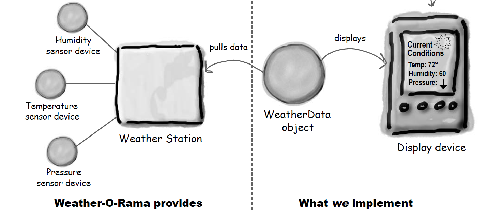
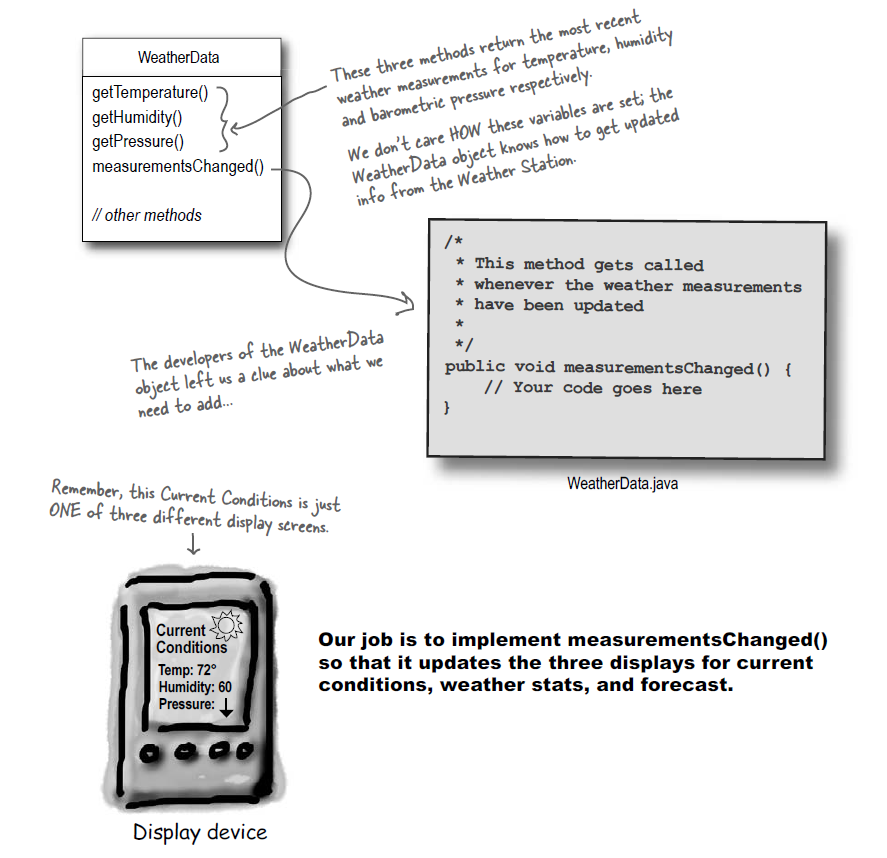
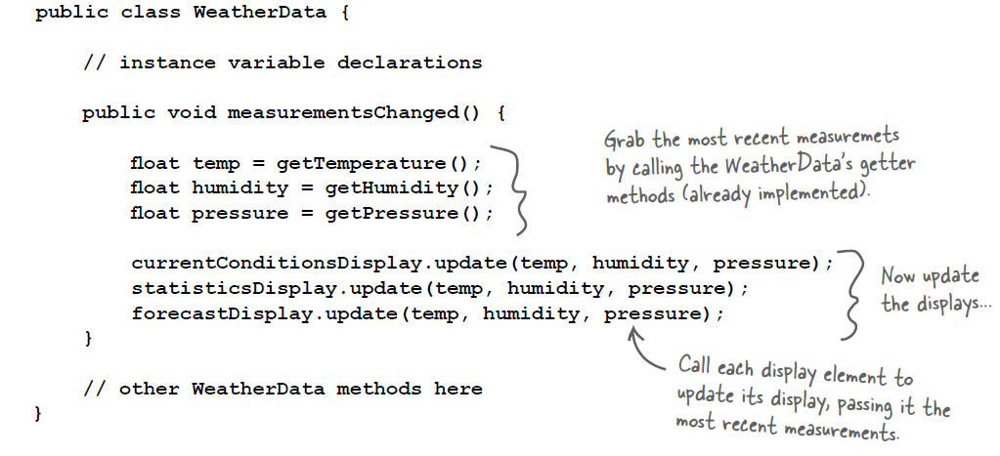
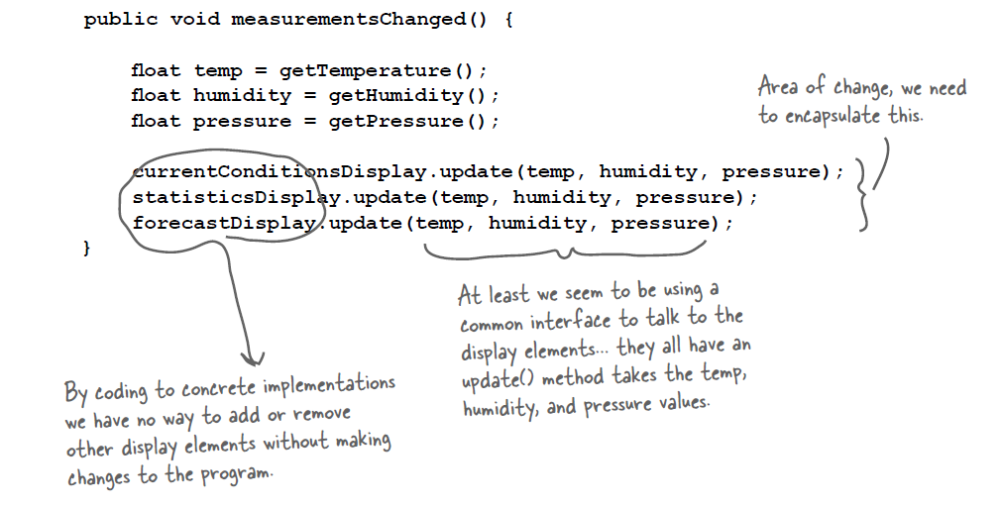
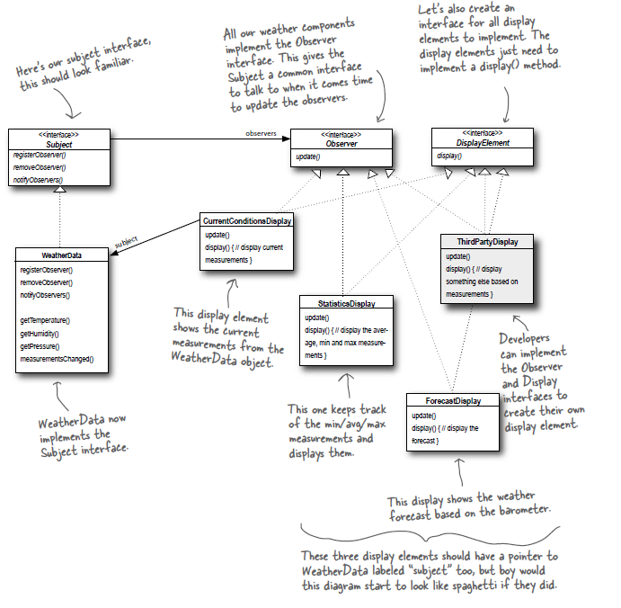

## Context
You were selected to build our next generation Internet-based Weather Monitoring Station!The weather station will be based on our patent pending WeatherData object, which tracks current weather conditions (temperature, humidity, and barometric pressure). Weʼd like
for you to create an application that initially provides three display elements: current conditions, weather statistics and a simple forecast, all updated in real time as the WeatherData object acquires the most recent measurements.
Further, this is an expandable weather station. Weather-ORama wants to release an API so that other developers can write their own weather displays and plug them right in.

## Problem
1. The measurementsChanged() method is called any time new weather measurement data is available. (We don’t know or care how this method is called; we just know that it is.)

2. We need to implement three display elements that use the weather data: a current conditions display, a statistics display and a forecast display. These displays must be updated each time WeatherData has new measurements.

2. The system must be expandable—other developers can create new custom display elements and users can add or remove as many display elements as they want to the application. Currently, we know about only the initial three display types (current conditions, statistics and forecast).

## Design Principles
1. When two objects are loosely coupled, they can interact,
but have very little knowledge of each other. Loosely coupled designs allow us to build flexible OO systems that can handle change because they minimize the interdependency between objects. [[4]](../../design_principles.md#L4)

## Solution
Using the observer pattern we create a loosely coupled integration between interfaces, in which, we don't depend on knowledge on Weather object, coupling with interfaces, it is possible to scale the number of displays without changing code:

