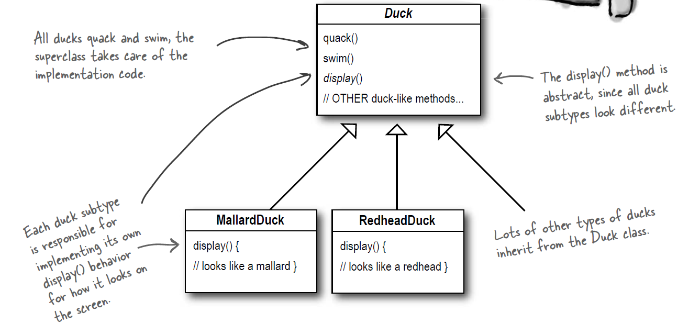
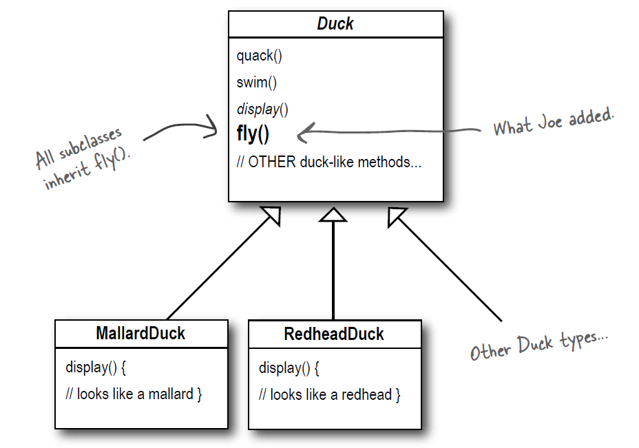
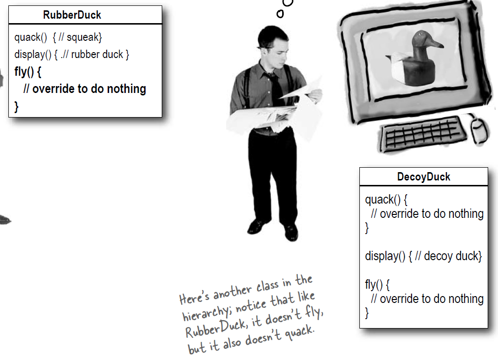
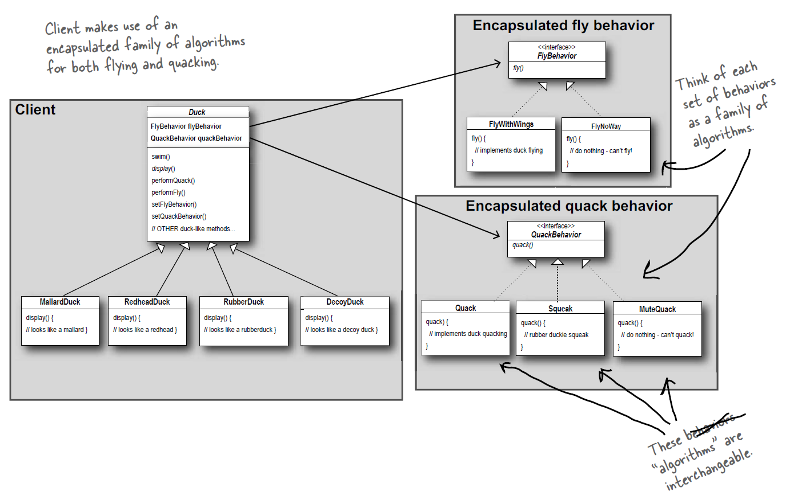

## Context
Joe works for a company that makes a highly successful duck pond simulation game, SimUDuck. The game can show a large variety of
duck species swimming and making quacking sounds. The initial designers of the system used standard OO techniques and created
one Duck superclass from which all other duck types inherit.

## Problem
1. The executives decided that flying ducks is just what the simulator needs to blow away the other duck sim competitors. Joe failed to notice that not all subclasses of Duck should fly. When Joe added new behavior to the Duck superclass, he was also adding
behavior that was not appropriate for some Duck subclasses.

2. Joe realized that inheritance probably wasn’t the answer, because he just got a memo that says that the executives now want to update the product every six months (in ways they haven’t yet decided on). Joe knows the spec will keep changing and he’ll be forced to look at and possibly override fly() and quack() for every new Duck subclass that’s ever added to the program... forever.

## Design Principles
1. If you’ve got some aspect of your code that is changing, say with every new requirement, then you know you’ve got a behavior that needs to be pulled out and separated from all the stuff that doesn’t change. [[1]](../../design_principles.md#L2)
2. Use an interface to represent each behavior – for instance, FlyBehavior and QuackBehavior – and each implementation of a behavior will implement one of those interfaces. [[2]](../../design_principles.md#L3)

## Solution
Instead of thinking of the duck behaviors as a set of behaviors, start thinking of them as a family of algorithms:

