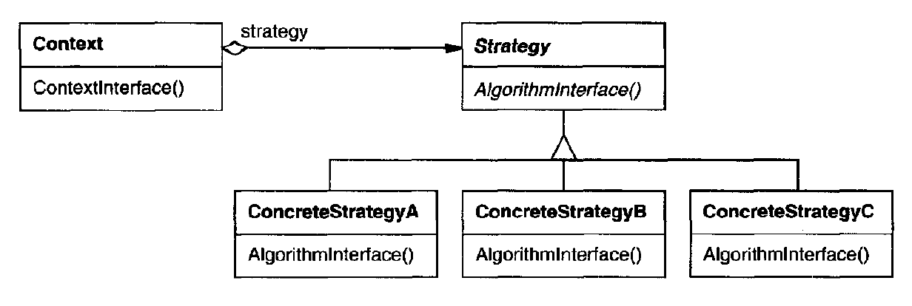

# Strategy

Define a family of algorithms, encapsulate each one, and make them interchangeable. Strategy lets the algorithm vary independently from clients that use it.

## Structure

#### Strategy
- Declares an interface common to all supported algorithms
- Context uses this interface to call the algorithm defined by ConcretStrategy
#### ConcreteStrategy
- Implements the algorithm using the Strategy interface
#### Context
- Configured with a ConcreteStrategy object
- Maintains a reference to a Strategy object
- May define an interface that lets Strategy access its data

## Example

Link: [SimUDuck](./problem.md)

## Applicability
- Many related classes differ only in their behavior. Strategies provide a way to configure a class with one of many behaviors.
- Different variants of an algorithm. Strategies can be
used when these variants are implemented as a class hierarchy of algorithms
- Algorithm uses data that clients shouldn't know about. Use the Strategy
pattern to avoid exposing complex, algorithm-specific data structures.
- Class defines many behaviors, and these appear as multiple conditional
statements in its operations. Instead of many conditionals, move related
conditional branches into their own Strategy class.

## Advantages vs Disavantages
1. <b>Families of related algorithms</b>: Hierarchies of Strategy classes define a family of algorithms or behaviors for contexts to reuse. Inheritance can help factor out common functionality of the algorithms.

2. <b>An alternative to subclassing</b>: Inheritance offers another way to support a variety of algorithms or behaviors. You can subclass a Context class directly to give it different behaviors. But this hard-wires the behavior into Context. It mixes the algorithm implementation with Context's, making Context harder to understand, maintain, and extend. And you can't vary the algorithm dynamically. You wind up with many related classes whose only difference is the algorithm or behavior they employ. Encapsulating the algorithm in separate Strategy classes lets you vary the algorithm independently of its context, making it easier to switch, understand, and extend.

3. <b>Strategies eliminate conditional statements</b>: The Strategy pattern offers an alternative to conditional statements for selecting desired behavior. When different behaviors are lumped into one class, it's hard to avoid using conditional statements to select the right behavior. Encapsulating the behavior in separate Strategy classes eliminates these conditional statements. Code containing many conditional statements often indicates the need to apply the Strategy pattern.

4. <b>A choice of implementations</b>: Strategies can provide different implementations of the same behavior. The client can choose among strategies with different time and space trade-offs.

5. <b>Clients must be aware of different Strategies</b>: The pattern has a potential drawback in that a client must understand how Strategies differ before it can select the appropriate one. Clients might be exposed to implementation issues. Therefore you should use the Strategy pattern only when the variation in behavior is relevant to clients.

6. <b>Communication overhead between Strategy and Context</b>: The Strategy interface is shared by all ConcreteStrategy classes whether the algorithms they implement are trivial or complex. Hence it's likely that some ConcreteStrategies won't use all the information passed to them through this interface. That means there will be times when the context creates and initializes parameters that never get used. If this is an issue, then you'll need tighter coupling between Strategy and Context.

7. <b>Increased number of objects</b>: Strategies increase the number of objects in an application. Sometimes you can reduce this overhead by implementing strategies as stateless objects that contexts can share. Any residual state is maintained by the context, which passes it in each request to the Strategy. Shared strategies should not maintain state across invocations.
